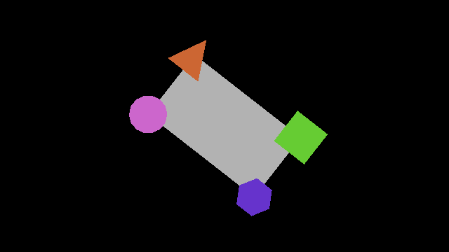

<div align="center">
<pre>
 ▄▄█▀▀██    ▄▄█▀▀██    ▄█▀▀▀▄█       ▀██▀▀█▄   ▀██▀  ▀█▀ ▀██▀ 
▄█▀    ██  ▄█▀    ██   ██▄▄  ▀   ██   ██   ██   ██    █   ██  
██      ██ ██      ██   ▀▀███▄  █  █  ██    ██  ██    █   ██  
▀█▄     ██ ▀█▄     ██ ▄     ▀██   ██  ██    ██  ██    █   ██  
 ▀▀█▄▄▄█▀   ▀▀█▄▄▄█▀  █▀▄▄▄▄█▀   ██  ▄██▄▄▄█▀    ▀█▄▄▀   ▄██▄ 
                                ██                            
                                █▄▄▄                          

                                
</pre>
An object-oriented approach to user interface for <a href="https://solar2d.com/">Solar2D</a>
</div>

## Concepts
### Parent Child Relationship
UI objects in OOS2DUI are able to hold relationships of dependence.  Every UI object is a potential parent **and** a potential child.  The parent is easily accessed from the child, and a specific child is efficiently accessed from the parent.
### Scale + Offset Size and Position
Instead of duples for size and position, OOS2DUI uses quadruples, which are used to calculate duples.  
|          | Duple  | Quadruple                              |   
|---------:|-------:|:---------------------------------------|
| Size     | (w, h) | (scale_w, scale_h, offset_w, offset_h) |
| Position | (x, y) | (scale_x, scale_y, offset_x, offset_y) |

Offset values are absolute.  Scale values are relative to the parent.  If there is no parent, the UI object will inherit from the screen.  Scale size depends on the parent size.  Scale values of 1 calculate 100% of parent size.  Examples are below:
| Parent's Calculated Size | Child's Quadruple  | Child's Calculated Size |
|-------------------------:|-------------------:|:------------------------|
| (100, 100)               | (0.8, 0.5, 0, 0)   | (80, 50)                |
| (100, 100)               | (0.8, 0.5, 10, 15) | (90, 65)                |
| (100, 100)               | (0, 0, 10, 15)     | (10, 45)                |

Scale position depends on both the parent position and the parent size.  Scale values of 0.5 calculate the center.  Examples are below:
| Parent's Calculated Position | Parent's Calculated Size | Child's Quadruple | Child's Calculated Position |
|-----------------------------:|-------------------------:|------------------:|:----------------------------|
| (500, 500)                   | (100, 100)               | (0.5, 0, 0, 0)    | (500, 450)                  |
| (500, 500)                   | (100, 100)               | (0.5, 0, 40, -20) | (540, 430)                  |
| (500, 500)                   | (100, 100)               | (1, 0, 40, -120)  | (590, 330)                  |
## Import Library
Importing the library means importing the map, and then importing what is needed.
```Lua
local oos2dui = require("oos2dui.map") -- Import map.
local polygon = require(oos2dui.polygon) -- Import polygon class.
```

## Example
Below is an example of some, ✨but not all✨, of OOS2DUI's features.
```Lua
local map = require("oos2dui.map")
local polygon = require(map.polygon)

local parent = polygon("parent", 4)
parent:set_size(0, 0, 192, 108)
parent.fill = {0.7}

local tri = polygon("tri", 3)
tri:set_size(0.18, 0.32, 20, 20)
tri:set_position(0, 0, 0, 0)
tri.rotation = 180
tri.fill = {0.8, 0.4, 0.2}
parent:add_child(tri)

local sq = polygon("sq", 4)
sq:set_size(0.18, 0.32, 20, 20)
sq:set_position(1, 0, 0, 0)
sq.fill = {0.4, 0.8, 0.2}
parent:add_child(sq)

local hex = polygon("hex", 6)
hex:set_size(0.18, 0.32, 20, 20)
hex:set_position(1, 1, 0, 0)
hex.rotation = 90
hex.fill = {0.4, 0.2, 0.8}
parent:add_child(hex)

local cir = polygon("cir", 14)
cir:set_size(0.18, 0.32, 20, 20)
cir:set_position(0, 1, 0, 0)
cir.fill = {0.8, 0.4, 0.8}
parent:add_child(cir)

parent.rotation = 38
parent:refresh_draw()
```

## Todo list
- [ ] Improve clarity of README.md
- [ ] Add more examples to README.md
- [ ] Add more unit tests
- [ ] Add keybinding and events
- [ ] Add transitions